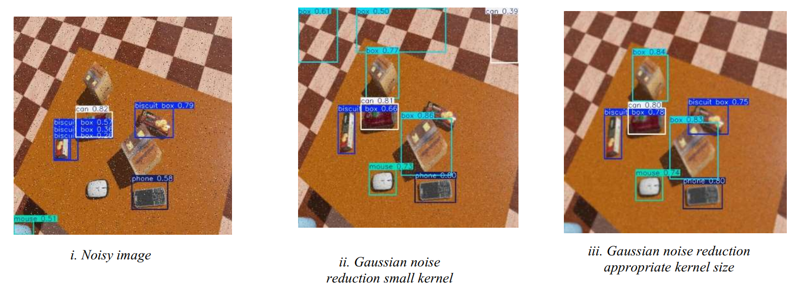
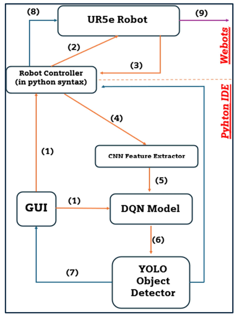

# Star if you like it ✨
Deep reinforcement learning (DRL) has emerged as a powerful tool for decision-making tasks involving complex environments. In this work, we develop and implement a DRL framework based on Deep Q-Networks (DQN) for a visionbased decision-making process. The system integrates a Convolutional Neural Network (CNN) to extract state information from raw image data and employs DQN for learning optimal policies in a dynamic environment.

  
   
  
   

